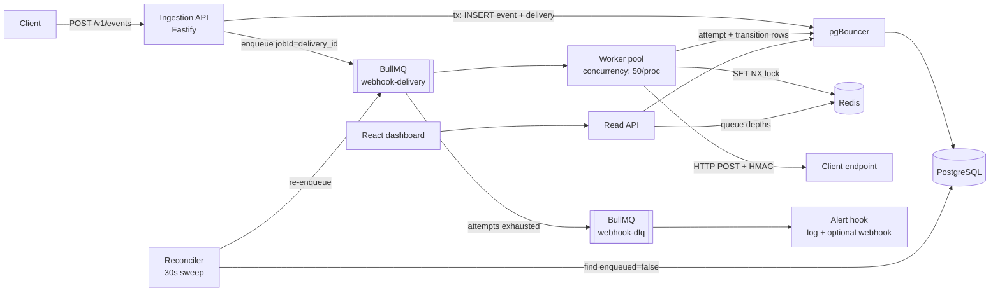

# Architecture — Distributed Webhook Delivery Engine

> Internal infrastructure service for reliable, at-least-once webhook delivery to client endpoints.
> Node.js + TypeScript · BullMQ · Redis · PostgreSQL (via pgBouncer) · Docker Compose.

---

## 1. System Overview



**Trust boundaries:** PostgreSQL is the source of truth. Redis is an accelerator and coordination layer — every Redis-held fact (idempotency seen-set, locks) has a durable backstop in Postgres. If Redis is wiped, the system degrades (slower dedupe, possible duplicate *attempts*) but never violates at-least-once or double-fires a delivered webhook.

---

## 2. Components

| Component | Responsibility |
|---|---|
| **Ingestion API** (Fastify) | Endpoint registration, event intake, idempotency enforcement, durable persist *before* ack, enqueue. Stateless, horizontally scalable. |
| **PostgreSQL** | Durable event log, delivery state, append-only attempt + transition history. The only component that must survive for correctness. |
| **pgBouncer** | Transaction-mode pooling. API + workers open hundreds of logical connections; Postgres sees ~20–30 real ones. |
| **BullMQ `webhook-delivery` queue** | Scheduling: delayed retries, backoff, stalled-job recovery. Job payload is just `{ deliveryId }` — full data lives in Postgres. |
| **Worker pool** | Acquire per-delivery lock → HTTP POST with HMAC signature → record outcome → release. Throws on failure to hand scheduling back to BullMQ. |
| **Reconciler** | Cron (every 30s) that sweeps deliveries persisted but never enqueued (crash between INSERT and `queue.add`). Closes the outbox gap. |
| **BullMQ `webhook-dlq` queue** | Terminal parking for exhausted deliveries. Feeds alert hooks; drained only by manual retry API. |
| **Read API + React dashboard** | Read-only views over Postgres + live queue counts from Redis. No auth (internal tool). Served as a separate `dashboard` container in compose (nginx hosting the Vite build, proxying `/api` → read API); in AWS the same static build goes behind the API or to S3+CloudFront. |

---

## 3. Data Flow

**v1 scope decision: one event → one delivery → one endpoint.** The client names the target `endpoint_id` in the POST body; ingestion creates exactly one `deliveries` row. Fan-out (one event to N subscribed endpoints) is explicitly out of scope for v1. The `UNIQUE (event_id, endpoint_id)` constraint is kept anyway: in v1 it's free insurance against a bug creating duplicate delivery rows, and it's already the natural key if subscription-based fan-out lands in v2 — the only ingestion change would be N inserts instead of 1.

1. `POST /v1/events` with header `Idempotency-Key`, body `{ event_type, payload, endpoint_id }`.
2. **Fast-path dedupe:** `SET wh:idem:{client_id}:{key} <event_id> NX EX 86400`. If key exists → return `200` with the original `event_id`. (Advisory only — see §6.)
3. **Durable persist (one transaction):** INSERT into `events`; on `ON CONFLICT (client_id, idempotency_key) DO NOTHING` → fetch existing row and return it (the DB constraint is the real dedupe). Otherwise INSERT `deliveries` row (`status='PENDING'`, `enqueued=false`) + a `PENDING` transition row. Commit.
4. **Enqueue:** `queue.add('deliver', { deliveryId }, { jobId: deliveryId })` → `UPDATE deliveries SET enqueued=true`. BullMQ jobId dedupe makes re-enqueue a no-op, so the reconciler and API can race safely.
5. **Ack:** `202 { event_id, delivery_id }`. Client is acked only after the event is on disk in Postgres — never from memory or Redis alone.
6. **Worker picks up job:**
   - Acquire `wh:lock:{deliveryId}` (SET NX PX 60000, random token). Fail → return without error (someone else owns it).
   - Re-read delivery from Postgres. If `status='DELIVERED'` → release lock, ack job. **This is the idempotent-retry guarantee.**
   - Circuit-breaker check: `wh:cb:{endpointId}:open` set and probe slot not won → record `CIRCUIT_OPEN` attempt (consumes an attempt, goes through backoff — correct behavior for a dead endpoint).
   - Token-bucket check (`token_bucket.lua`): no tokens → **not an attempt.** Release lock, `job.moveToDelayed(now + 5_000 ± jitter, token)` + throw `DelayedError`. `deliveries.status` is untouched (stays `PENDING` or `FAILED`, whatever it was), **no attempt row, no transition row** — just a `rate_limited_total` counter metric. The attempt budget and the audit trail are reserved for actual delivery decisions; a rate-limited pickup is queue mechanics, not a delivery event.
   - Transition `→ DELIVERING` (+ transition row).
   - HTTP POST via undici, 10s total timeout, headers: `X-Webhook-Id` (delivery_id), `X-Webhook-Attempt`, `X-Webhook-Signature: sha256=HMAC(signing_secret, body)`.
   - Record `delivery_attempts` row + status update **in one transaction**.
   - 2xx → `DELIVERED`, ack. Non-2xx/timeout → `FAILED` (+ row), release lock, **throw** → BullMQ schedules retry with backoff.
7. **Exhaustion:** after attempt 5 fails, worker `failed` handler moves job to `webhook-dlq`, transitions `→ DLQ`, fires alert hook.
8. **Manual retry:** `POST /v1/dlq/:deliveryId/retry` → verify `status='DLQ'` → transition `→ PENDING` (actor=`manual-retry`) → enqueue with `jobId: ${deliveryId}:retry:${retryEpoch}` (fresh jobId, fresh attempt budget).

State machine (enforced in code, audited in `delivery_transitions`):

```
PENDING → DELIVERING → DELIVERED          (terminal)
                    ↘ FAILED → DELIVERING (retry)
                             ↘ DLQ → PENDING (manual retry only)
```

---

## 4. Redis Key Structure

| Key pattern | Type | TTL | Purpose |
|---|---|---|---|
| `wh:idem:{clientId}:{idemKey}` | string (event_id) | 24 h | Fast-path duplicate rejection. Advisory — DB unique constraint is authoritative. |
| `wh:lock:{deliveryId}` | string (random 16-byte token) | 60 s (PX 60000) | Per-delivery mutex. Token prevents releasing someone else's lock. |
| `wh:cb:{endpointId}:fails` | counter | 300 s | Rolling failure count per endpoint (circuit breaker input). |
| `wh:cb:{endpointId}:open` | flag | 60 s | Breaker open → worker fails fast with `CIRCUIT_OPEN` (counts as a normal failed attempt, goes through backoff). |
| `wh:cb:{endpointId}:probe` | flag | 10 s | Half-open probe slot — `SET NX` winner gets the one real request after the open flag expires. |
| `wh:rl:{endpointId}` | hash (tokens, ts) | 120 s idle | Token bucket: max 50 concurrent in-flight deliveries per endpoint. Stops one slow endpoint from monopolizing the worker pool. |
| `bull:webhook-delivery:*` | — | managed | BullMQ internals (wait/active/delayed/completed sets, job hashes). |
| `bull:webhook-dlq:*` | — | managed | DLQ queue internals. `removeOnFail: false` — DLQ jobs are kept until manually resolved. |

**Circuit breaker lifecycle (explicit, because the implicit version bites):**

1. **Closed:** every failed attempt runs `INCR wh:cb:{id}:fails` + `EXPIRE 300`. Counter ≥ 20 → `SET wh:cb:{id}:open 1 EX 60`.
2. **Open:** workers seeing the `open` flag record `CIRCUIT_OPEN` without touching the endpoint.
3. **Half-open:** the `open` key expiring *is* the half-open state. The next worker does `SET wh:cb:{id}:probe 1 NX EX 10` — the winner sends one real request; losers still fail fast as `CIRCUIT_OPEN` (no probe stampede).
4. **Probe succeeds** → `DEL fails`, `DEL probe`; breaker fully closed, counter starts from zero.
5. **Probe fails** → immediately re-`SET open EX 60` (one failure re-opens — we do *not* wait for 20 again; the endpoint already proved itself sick) and `DEL probe`.

**Lua scripts** (atomicity where GET-then-act would race):

- `release_lock.lua` — `if redis.call('GET', key) == token then return redis.call('DEL', key) end`. Never release a lock you no longer own (TTL expired mid-delivery, another worker acquired it).
- `extend_lock.lua` — same token check, then `PEXPIRE 60000`. Called by a heartbeat every 20s while the HTTP request is in flight, so slow endpoints don't outlive the lock.
- `token_bucket.lua` — atomic check-and-decrement for per-endpoint concurrency cap; returns remaining tokens or -1.

**BullMQ config (the parts that matter):**

```ts
new Queue('webhook-delivery', {
  defaultJobOptions: {
    attempts: 5,
    backoff: { type: 'webhook-backoff' },          // custom strategy, see below
    removeOnComplete: { age: 3600, count: 10_000 }, // Redis hygiene under load
    removeOnFail: false,
  },
});

new Worker('webhook-delivery', processor, {
  concurrency: 50,
  lockDuration: 90_000,      // > max HTTP timeout + tx time; BullMQ's own job lock
  stalledInterval: 30_000,
  maxStalledCount: 1,        // stall twice → BullMQ fails the job → our backoff applies
  settings: {
    backoffStrategy: (attemptsMade: number) => {
      const base = [10_000, 30_000, 120_000, 600_000, 3_600_000][attemptsMade - 1];
      return base / 2 + Math.floor(Math.random() * (base / 2)); // equal jitter
    },
  },
});
```

**Why jitter:** when an endpoint that takes 500 errors for 5 minutes recovers, every failed delivery retries on the same schedule. Without jitter they arrive as a synchronized wave and knock the endpoint over again. Equal jitter (`base/2 + rand(base/2)`) keeps the floor predictable (ops can reason about "retry ~3 happens within 1–2m") while decorrelating the herd.

---

## 5. PostgreSQL Schema

```sql
CREATE TABLE endpoints (
  id              uuid PRIMARY KEY DEFAULT gen_random_uuid(),
  client_id       text NOT NULL,
  url             text NOT NULL,
  signing_secret  text NOT NULL,   -- plaintext in v1; v2: encrypt at rest (app-level AES-256-GCM, key from KMS)
  is_active       boolean NOT NULL DEFAULT true,
  created_at      timestamptz NOT NULL DEFAULT now()
);

CREATE TABLE events (
  id               uuid PRIMARY KEY DEFAULT gen_random_uuid(),
  client_id        text NOT NULL,
  idempotency_key  text NOT NULL,
  event_type       text NOT NULL,
  payload          jsonb NOT NULL,            -- capped at 256 KB at the API edge
  received_at      timestamptz NOT NULL DEFAULT now(),
  CONSTRAINT uq_events_client_idem UNIQUE (client_id, idempotency_key)
);

CREATE TABLE deliveries (
  id               uuid PRIMARY KEY DEFAULT gen_random_uuid(),
  event_id         uuid NOT NULL REFERENCES events(id),
  endpoint_id      uuid NOT NULL REFERENCES endpoints(id),
  status           text NOT NULL DEFAULT 'PENDING'
                     CHECK (status IN ('PENDING','DELIVERING','DELIVERED','FAILED','DLQ')),
  attempt_count    int  NOT NULL DEFAULT 0,
  next_attempt_at  timestamptz,
  enqueued         boolean NOT NULL DEFAULT false,   -- outbox flag, reconciler sweeps false
  created_at       timestamptz NOT NULL DEFAULT now(),
  updated_at       timestamptz NOT NULL DEFAULT now(),
  -- v1 is strictly 1 event : 1 delivery (see §3). Constraint kept as dup-row insurance
  -- and as the natural key if subscription fan-out arrives in v2.
  CONSTRAINT uq_deliveries_event_endpoint UNIQUE (event_id, endpoint_id)
);

-- Append-only. No UPDATE or DELETE, ever.
CREATE TABLE delivery_attempts (
  id              bigint GENERATED ALWAYS AS IDENTITY PRIMARY KEY,
  delivery_id     uuid NOT NULL REFERENCES deliveries(id),
  attempt_number  int  NOT NULL,
  -- RATE_LIMITED is deliberately NOT an outcome: a rate-limited pickup is requeued
  -- without consuming an attempt and writes no rows at all (see §3).
  outcome         text NOT NULL
                    CHECK (outcome IN ('SUCCESS','HTTP_ERROR','TIMEOUT','CONN_ERROR','CIRCUIT_OPEN','LOCK_LOST')),
  http_status     int,
  response_body   text,                      -- truncated to 4 KB before insert
  error_message   text,
  latency_ms      int,
  started_at      timestamptz NOT NULL,
  finished_at     timestamptz NOT NULL,
  CONSTRAINT uq_attempts UNIQUE (delivery_id, attempt_number)
);

-- Append-only audit log. Every state change, no exceptions.
CREATE TABLE delivery_transitions (
  id           bigint GENERATED ALWAYS AS IDENTITY PRIMARY KEY,
  delivery_id  uuid NOT NULL REFERENCES deliveries(id),
  from_status  text,                          -- NULL on creation
  to_status    text NOT NULL,
  reason       text,                          -- 'http_503', 'timeout_10s', 'attempts_exhausted', ...
  actor        text NOT NULL DEFAULT 'worker' -- worker | api | reconciler | manual-retry
                 CHECK (actor IN ('worker','api','reconciler','manual-retry')),
  created_at   timestamptz NOT NULL DEFAULT now()
);
```

**Indexes:**

```sql
-- Reconciler sweep: tiny partial index, stays hot in memory
CREATE INDEX idx_deliveries_unenqueued ON deliveries (created_at) WHERE enqueued = false;

-- Dashboard live feed + filters
CREATE INDEX idx_deliveries_status_updated ON deliveries (status, updated_at DESC);
CREATE INDEX idx_deliveries_endpoint_created ON deliveries (endpoint_id, created_at DESC);

-- Postgres does NOT auto-index FK columns; without this, "all deliveries for event X" seq-scans
CREATE INDEX idx_deliveries_event ON deliveries (event_id);

-- Per-job drill-down
CREATE INDEX idx_attempts_delivery ON delivery_attempts (delivery_id, attempt_number);
CREATE INDEX idx_transitions_delivery ON delivery_transitions (delivery_id, id);

-- Time-range scans on append-only tables: BRIN is ~1000x smaller than btree
CREATE INDEX idx_attempts_brin ON delivery_attempts USING brin (started_at);
CREATE INDEX idx_transitions_brin ON delivery_transitions USING brin (created_at);
```

**Why append-only for attempts/transitions:**

- **Auditability** — "what did the client's endpoint return on attempt 3 at 02:14" is answerable forever; an UPDATE-in-place model destroys that. In fintech this is a compliance requirement, not a nicety.
- **Write performance** — INSERT-only tables take no row locks against readers and never bloat from HOT-update churn. The hot write path (an attempt row per delivery attempt) is contention-free.
- **Debuggability** — the transition log *is* the state machine trace. A delivery with `PENDING → DELIVERING → DELIVERED` and *also* a later `DELIVERING` row is a bug you can see in SQL.
- The only mutable row is `deliveries` (current status + scheduling fields) — one row per delivery, updated by exactly one lock-holding worker at a time.

---

## 6. Failure Handling

| # | Failure point | What happens | Why it's safe |
|---|---|---|---|
| 1 | API crashes **after** Postgres commit, **before** `queue.add` | Delivery row exists with `enqueued=false`. Reconciler sweeps every 30s: `SELECT id FROM deliveries WHERE enqueued = false AND created_at < now() - interval '60 seconds' FOR UPDATE SKIP LOCKED` → enqueues with `jobId=delivery_id`. | Outbox pattern. jobId dedupe means the sweep can race the original `queue.add` harmlessly. `SKIP LOCKED` lets multiple reconciler instances coexist. |
| 2 | API crashes **before** commit | Client gets no 202 → client retries with same `Idempotency-Key` → fresh insert succeeds. | The ack *is* the durability receipt. |
| 3 | Duplicate event POST | Redis SETNX rejects in ~1ms; if Redis lost the key (restart, TTL), `ON CONFLICT` on `uq_events_client_idem` catches it. Same `event_id` returned both ways. | Two layers; DB layer is authoritative. |
| 4 | Worker crashes mid-delivery | BullMQ job lock expires → stalled checker re-queues the job → another worker picks it up, acquires `wh:lock` (old one expired via TTL), re-reads status. If the HTTP call actually landed but we died before recording: status is still `DELIVERING`, worker re-sends. **This is the at-least-once duplicate window** — receivers dedupe on `X-Webhook-Id`. | No lost deliveries; bounded, documented duplicate window. |
| 5 | HTTP call outlives the Redis lock | Heartbeat extends the lock every 20s via `extend_lock.lua`. If extension fails (token mismatch — we lost it), abort, record outcome `LOCK_LOST`, throw for retry. | Never write a DELIVERED status with a lock you don't hold. |
| 6 | Endpoint returns 5xx / times out | Attempt row recorded, status `FAILED`, throw → BullMQ backoff (10s→30s→2m→10m→1h, jittered). | Standard retry path. |
| 7 | Endpoint down hard | Circuit breaker opens after 20 failures/5min → subsequent attempts fail fast (`CIRCUIT_OPEN`) without burning worker time or sockets. Half-open after 60s = single SETNX-elected probe; probe failure re-opens immediately (see §4 lifecycle). | Failed-fast attempts still consume retry slots → eventually DLQ, which is correct for a dead endpoint. |
| 8 | All 5 attempts exhausted | `failed` handler: transition `→ DLQ`, add to `webhook-dlq` queue, fire alert hook (structured log always; alert webhook if configured — alert webhook failures are logged and dropped, never retried, to avoid recursive meta-delivery). | DLQ is terminal-until-human. Manual retry resets the budget under a new jobId. |
| 9 | Redis dies | Ingestion still persists to Postgres (idempotency via DB constraint) but can't enqueue → `enqueued=false` accumulates. When Redis returns, reconciler drains the backlog. Workers idle harmlessly. | Degraded throughput, zero data loss. |
| 10 | Postgres dies | API returns 503 immediately. Workers fail their re-read step and throw → retries later. **No ack without durability, ever.** | The one dependency we refuse to operate without. |
| 11 | Retrying an already-DELIVERED job (stall edge, manual mistake) | Worker's post-lock status re-read sees `DELIVERED` → no-op, ack. | Idempotent retry guarantee, enforced at the worker, not the queue. |

Every row in this table maps to a chaos test in the failure-simulation harness (see PLAN.md week 2) — documented *and* testable.

---

## 7. Scale Considerations (2000 VUs)

Rough budget: 2000 k6 VUs with ~1s think time ≈ **~2000 req/s sustained ingestion**, each request = 1 Redis SETNX + 1 Postgres tx (2 inserts) + 1 `queue.add`.

- **Ingestion is Postgres-write-bound, by design.** Fastify does 30k+ req/s of routing; undici and Redis are sub-millisecond. The tx commit is the floor (~2–5ms). pgBouncer in transaction mode with `default_pool_size=20` keeps Postgres at a connection count it can actually schedule; without it, 2000 concurrent clients → 2000 backends → context-switch collapse. **Expected saturation point: pgBouncer pool wait time**, which shows up as ingestion p95 climbing while Postgres CPU stays modest. That's the number the k6 report should name.
- **`synchronous_commit = on` stays on** (durability is the product). Throughput lever if needed: group commit is automatic; next lever is batching event inserts behind a 5ms micro-buffer — explicitly out of scope for v1, noted as an ADR.
- **Workers scale horizontally** — stateless, coordination entirely via Redis/BullMQ. The baseline is pinned in `docker-compose.yml` (`worker: deploy.replicas: 2`, `WORKER_CONCURRENCY=50`) = 100 in-flight HTTP deliveries, so every load-test number is reproducible against a declared topology. Delivery lag (enqueue→first attempt) is the metric; `--scale worker=N` is the knob.
- **Backpressure:** API checks `queue.getJobCounts()` (cached 1s) — if `wait + delayed > 50_000`, return `429 Retry-After: 5`. Shed at the edge, before Postgres, rather than letting delivery lag silently grow unbounded.
- **Head-of-line blocking:** one endpoint hanging for 10s × many events would eat the whole worker pool. The per-endpoint token bucket (50 in-flight max) caps the damage; excess jobs throw `RATE_LIMITED` and land back in the delayed set with a short (5s, jittered) delay that does **not** consume an attempt.
- **Redis hygiene:** `removeOnComplete: { age: 3600, count: 10_000 }` — at 2000 jobs/s, keeping completed jobs forever would OOM Redis in minutes. Job payloads are `{ deliveryId }` only (~40 bytes); full payloads live in Postgres.
- **Read path isolation:** dashboard queries hit the partial/covering indexes above and are paginated (keyset on `updated_at, id`). At v1 scale one Postgres serves both; the schema is read-replica-ready since the dashboard tolerates seconds of staleness.
- **Honest limits:** single-node Redis and single-node Postgres are accepted SPOFs for this build (Compose-local, AWS-ready). The AWS path is ElastiCache + RDS Multi-AZ; nothing in the design assumes single-node semantics except lock latency.
